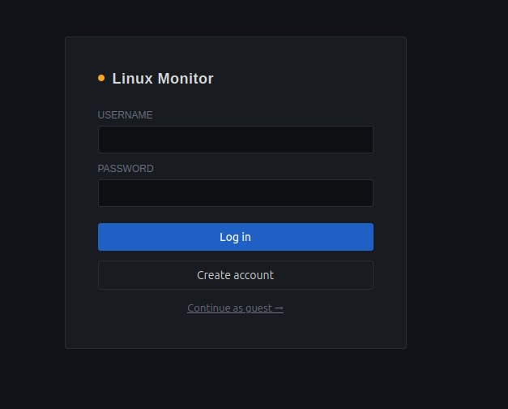
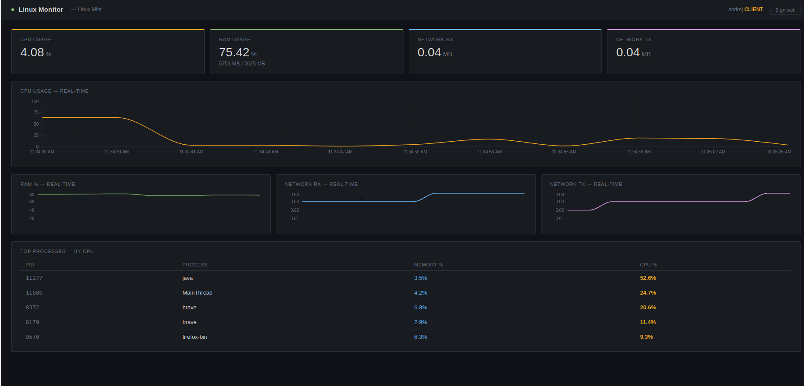
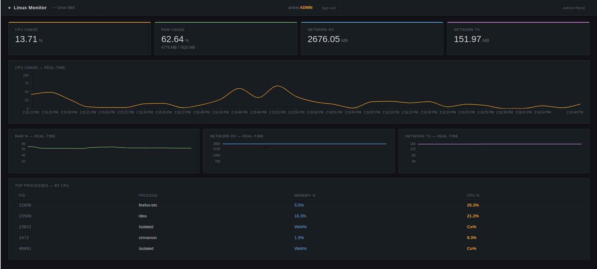
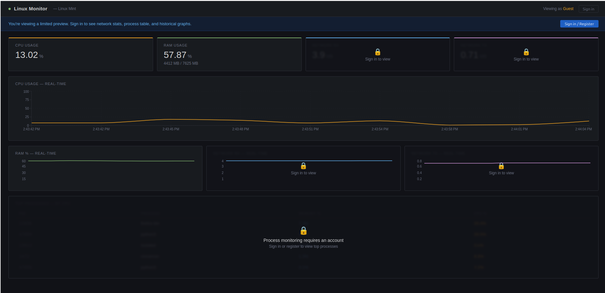
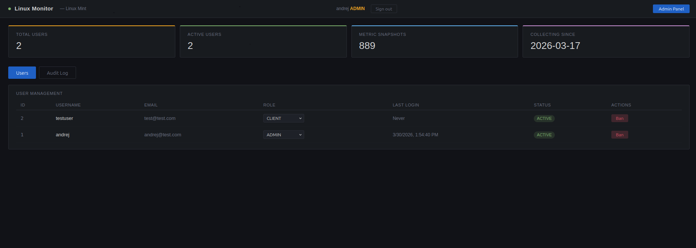

# Linux Monitor

A full-stack, real-time Linux system monitoring platform built with Java Spring Boot, PostgreSQL, Python, React, and Docker. Inspired by professional tools like Grafana and Zabbix.

     

---

## Screenshots

> Login screen — supports username/password and Google OAuth2



> Dashboard Client — real-time metrics, graphs, and process table



> Dashboard Admin — real-time metrics, graphs, and process table



> Dashboard Guest — real-time metrics, graphs, and process table



> Admin panel — user management, role control, audit log



---

## Features

- **Real-time monitoring** — CPU, RAM, Network RX/TX refreshed every 3 seconds
- **Time-series persistence** — all metrics saved to PostgreSQL every 5 seconds
- **Live graphs** — CPU history chart + mini charts for RAM, Network RX/TX
- **Top processes** — live process table sorted by CPU usage (reads from Linux /proc)
- **JWT authentication** — stateless token-based auth with BCrypt password hashing
- **Google OAuth2** — login with Google account, auto-creates local user on first login
- **Role-based access** — Admin, Moderator, Client, and Guest with different permissions
- **Guest preview** — unregistered users see live CPU/RAM with locked overlays on restricted data
- **User registration** — create account directly from the login screen
- **Admin panel** — manage users, change roles, ban/unban, system summary stats
- **Audit log** — every admin action logged with timestamp, actor, and target
- **Dockerized** — single `docker compose up --build` starts the entire stack

---

## Architecture

```
React Frontend (port 3000)
        │
        │  HTTP + JWT in Authorization header
        ▼
Spring Boot API (port 8080)
        │                    │                    │
        │ @Scheduled/5s      │ REST responses      │ OAuth2 redirect
        ▼                    ▼                    ▼
   Python stats.py      PostgreSQL 16        Google servers
   reads /proc/*        metrics + users      verify identity
```

The Python collector runs on a Spring `@Scheduled` timer — not per request. This means zero Python overhead on API calls. The API reads the latest saved value from the database — instantaneous response regardless of collection frequency.

---

## Tech Stack

| Layer | Technology |
|-------|-----------|
| Backend | Java 21, Spring Boot 4.0.3 |
| Security | Spring Security, JWT (jjwt 0.12.6), BCrypt, Google OAuth2 |
| Database | PostgreSQL 16 |
| ORM | Spring Data JPA, Hibernate 7 |
| System collector | Python 3 (reads `/proc/stat`, `/proc/meminfo`, `/proc/net/dev`) |
| Frontend | React 18, Recharts, Axios |
| Containerization | Docker, Docker Compose |
| Build tool | Maven (with Maven Wrapper) |

---

## Project Structure

```
linux-monitor/
├── src/main/java/com/andrej/linux_monitor/
│   ├── config/
│   │   └── SecurityConfig.java          # Spring Security + CORS + OAuth2
│   ├── controller/
│   │   ├── StatsController.java         # GET /api/stats, GET /api/stats/history
│   │   ├── AuthController.java          # POST /api/auth/register, /login
│   │   └── AdminController.java         # /api/admin/* — ADMIN role only
│   ├── dto/
│   │   ├── StatsDto.java                # CPU, RAM, network, processes shape
│   │   ├── AuthResponse.java            # token, username, role
│   │   ├── LoginRequest.java
│   │   ├── RegisterRequest.java
│   │   ├── UserSummaryDto.java          # safe user data (no password)
│   │   ├── AdminStatsDto.java           # system summary for admin panel
│   │   └── RoleUpdateRequest.java
│   ├── model/
│   │   ├── MetricSnapshot.java          # metrics table entity
│   │   ├── User.java                    # users table entity
│   │   ├── Role.java                    # ADMIN | MODERATOR | CLIENT enum
│   │   └── AuditLog.java               # audit_log table entity
│   ├── repository/
│   │   ├── MetricRepository.java
│   │   ├── UserRepository.java
│   │   └── AuditRepository.java
│   ├── security/
│   │   ├── JwtUtil.java                 # generate + validate JWT tokens
│   │   ├── JwtFilter.java               # OncePerRequestFilter
│   │   └── OAuth2SuccessHandler.java    # find/create user after Google login
│   └── service/
│       ├── StatsService.java            # calls stats.py via ProcessBuilder
│       ├── MetricCollector.java         # @Scheduled — saves metrics every 5s
│       ├── AuthService.java             # register + login logic
│       ├── AdminService.java            # user management + audit log
│       ├── OAuth2UserService.java       # loads Google user info
│       └── UserDetailsServiceImpl.java  # Spring Security user loader
├── frontend/src/
│   ├── App.js                           # routing only
│   ├── constants.js                     # COLORS + API URL
│   └── components/
│       ├── Login.jsx
│       ├── Register.jsx
│       ├── Dashboard.jsx
│       ├── AdminPanel.jsx
│       ├── StatCard.jsx
│       ├── MiniChart.jsx
│       └── OAuth2Callback.jsx
├── stats.py                             # Python system metrics collector
├── Dockerfile                           # multi-stage build
├── docker-compose.yml                   # app + PostgreSQL services
└── pom.xml
```

---

## Getting Started

### Prerequisites

- Docker and Docker Compose
- Git

### Run with Docker (recommended)

```bash
git clone https://github.com/AT95BL/linux-monitor.git
cd linux-monitor
docker compose up --build
```

- API available at: `http://localhost:8080`
- Start the frontend separately (see below)

### Register your first admin user

```bash
# Register
curl -X POST http://localhost:8080/api/auth/register \
  -H "Content-Type: application/json" \
  -d '{"username":"andrej","email":"andrej@example.com","password":"YourPassword123!"}'

# Promote to admin
docker exec -it linux-monitor-db-1 psql -U andrej -d linux_monitor \
  -c "UPDATE users SET role='ADMIN' WHERE username='andrej';"
```

### Run the frontend

```bash
cd frontend
npm install
npm start
```

Open `http://localhost:3000`

### Run locally without Docker

1. Install Java 21, PostgreSQL 16, Python 3
2. Create the database:

```sql
CREATE DATABASE linux_monitor;
CREATE USER andrej WITH PASSWORD 'yourpassword';
GRANT ALL PRIVILEGES ON DATABASE linux_monitor TO andrej;
GRANT ALL ON SCHEMA public TO andrej;
```

3. Update `src/main/resources/application.properties` with your credentials
4. Run:

```bash
./mvnw spring-boot:run
```

---

## API Reference

### Public

| Method | Endpoint | Description |
|--------|----------|-------------|
| `GET` | `/api/stats` | Current system metrics — CPU, RAM, network, processes |
| `POST` | `/api/auth/register` | Register a new user |
| `POST` | `/api/auth/login` | Login — returns JWT token |
| `GET` | `/oauth2/authorization/google` | Start Google OAuth2 login |

### Authenticated

| Method | Endpoint | Description |
|--------|----------|-------------|
| `GET` | `/api/stats/history?minutes=30` | Historical metrics from database |

### Admin only

| Method | Endpoint | Description |
|--------|----------|-------------|
| `GET` | `/api/admin/users` | List all users |
| `PUT` | `/api/admin/users/{id}/role` | Change a user's role |
| `PUT` | `/api/admin/users/{id}/status` | Ban or unban a user |
| `GET` | `/api/admin/audit` | View audit log |
| `GET` | `/api/admin/stats` | System summary stats |

### Using the token

```
Authorization: Bearer <your-jwt-token>
```

---

## Role Permissions

| Feature | Guest | Client | Moderator | Admin |
|---------|:-----:|:------:|:---------:|:-----:|
| Live CPU & RAM | ✅ | ✅ | ✅ | ✅ |
| Network stats | ❌ | ✅ | ✅ | ✅ |
| Process table | ❌ | ✅ | ✅ | ✅ |
| Metric history | ❌ | ✅ | ✅ | ✅ |
| View user list | ❌ | ❌ | ✅ | ✅ |
| Manage users | ❌ | ❌ | ❌ | ✅ |
| Change roles | ❌ | ❌ | ❌ | ✅ |
| Ban/unban users | ❌ | ❌ | ❌ | ✅ |
| Audit log | ❌ | ❌ | ❌ | ✅ |

---

## Database Schema

```sql
CREATE TABLE metrics (
    id           BIGSERIAL PRIMARY KEY,
    recorded_at  TIMESTAMP,
    cpu_percent  FLOAT,
    ram_used_mb  BIGINT,
    ram_total_mb BIGINT,
    ram_percent  FLOAT,
    rx_mb        FLOAT,
    tx_mb        FLOAT
);

CREATE TABLE users (
    id          BIGSERIAL PRIMARY KEY,
    username    VARCHAR UNIQUE NOT NULL,
    email       VARCHAR UNIQUE NOT NULL,
    password    VARCHAR NOT NULL,  -- BCrypt hash or 'OAUTH2_USER'
    role        VARCHAR,           -- ADMIN | MODERATOR | CLIENT
    created_at  TIMESTAMP,
    last_login  TIMESTAMP,
    active      BOOLEAN DEFAULT true
);

CREATE TABLE audit_log (
    id            BIGSERIAL PRIMARY KEY,
    performed_by  VARCHAR,
    action        VARCHAR,  -- ROLE_CHANGE | USER_BANNED | USER_UNBANNED
    target_user   VARCHAR,
    performed_at  TIMESTAMP
);
```

---

## Google OAuth2 Setup

1. Go to [console.cloud.google.com](https://console.cloud.google.com) and create a project
2. **APIs & Services → OAuth consent screen** — configure app name and email
3. **APIs & Services → Credentials → Create OAuth Client ID**
   - Type: Web application
   - Authorized redirect URI: `http://localhost:8080/login/oauth2/code/google`
4. Add to `application.properties`:

```properties
spring.security.oauth2.client.registration.google.client-id=YOUR_CLIENT_ID
spring.security.oauth2.client.registration.google.client-secret=YOUR_CLIENT_SECRET
spring.security.oauth2.client.registration.google.scope=email,profile
```

> Never commit your Client Secret to a public repository.

---

## What I Learned

- Designing a multi-layer Java backend with Spring Boot, JPA, and Spring Security
- Implementing stateless JWT authentication with role-based access control
- Integrating Google OAuth2 — consent screen, authorization code flow, token exchange
- Using `@Scheduled` for background metric collection instead of per-request processing
- Reading Linux kernel data directly from `/proc` filesystem using Python
- Multi-stage Docker builds to minimize final image size
- Connecting containerized services via Docker Compose internal networking (`db:5432` not `localhost`)
- Debugging CORS issues caused by Spring Security intercepting OPTIONS preflight requests
- Building a Grafana-style React dashboard with component-based architecture

---

## Author

**Andrej Trožić**
- GitHub: [@AT95BL](https://github.com/AT95BL)
- LinkedIn: [Andrej Trožić](https://www.linkedin.com/in/andrej-tro%C5%BEi%C4%87-57957122b/)
- Portfolio: [at95-portfolio.com](https://at95bl.github.io/html-portfolio/)

---

## License

MIT License — feel free to use this project as a reference or starting point.
